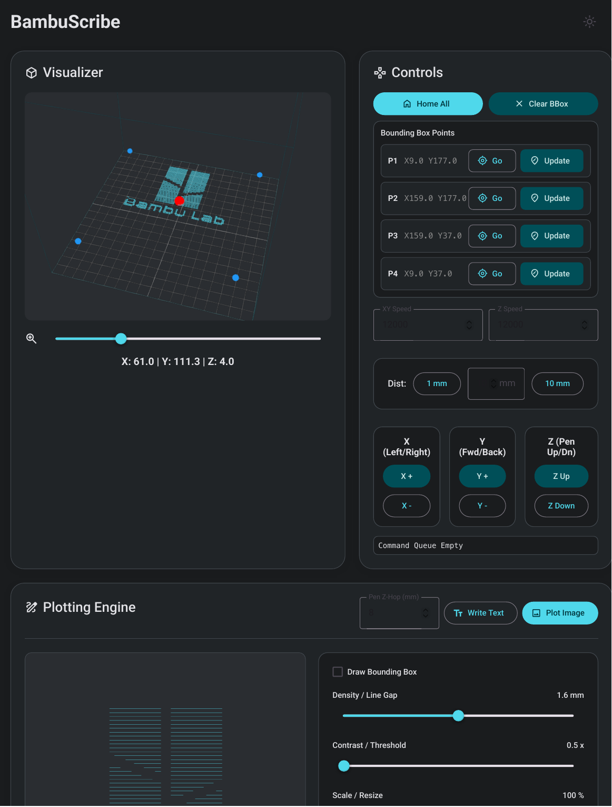
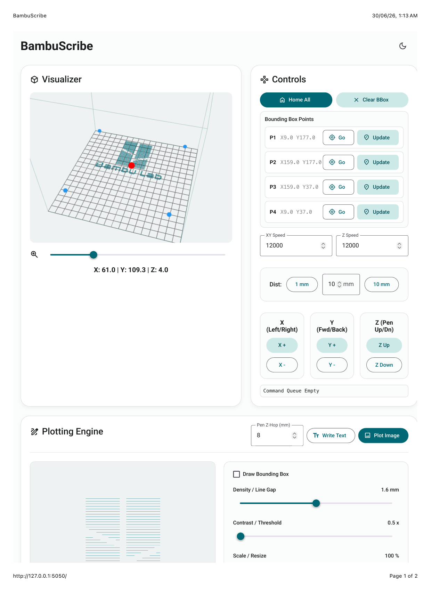
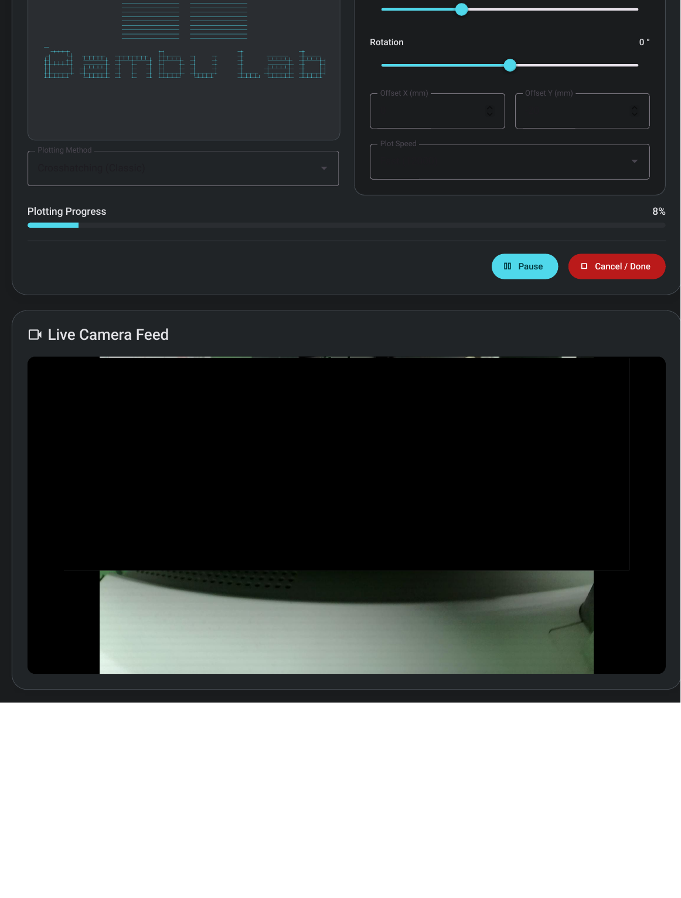
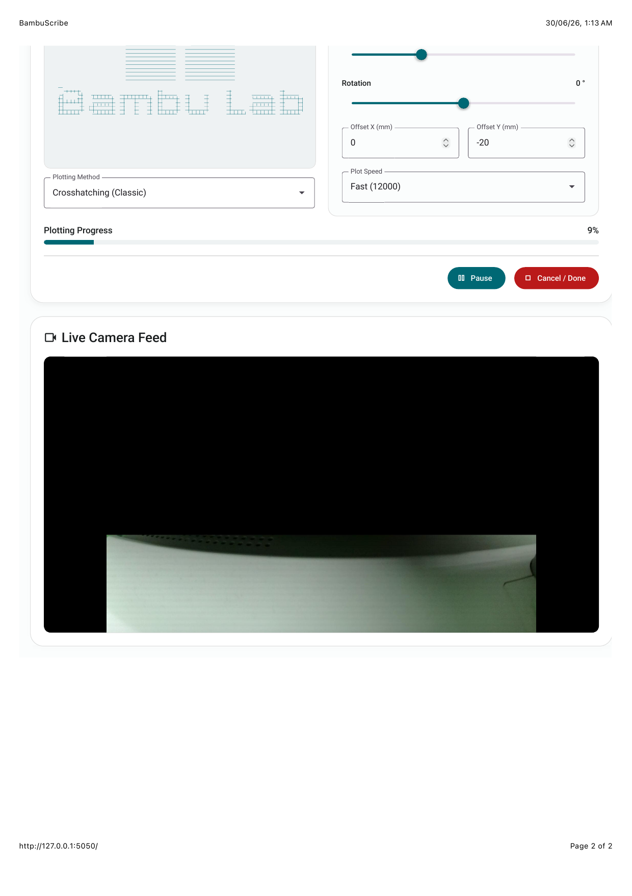

Here is the updated README! I used a clean Markdown table to align the images exactly as you described: Dark Mode (Page 1 top, Page 2 bottom) in the left column, and Light Mode (Page 1 top, Page 2 bottom) in the right column. This ensures they scale perfectly next to each other.

***

# BAMBUSCRIBE
**An open-source suite to transform your Bambu Lab 3D printer into a precision 2D plotter**

> **Release v1.0.0**
> 
> **Development Philosophy:** *Make it exist first, make it good later.* 
> BambuScribe is currently in its initial release phase. While the core architecture is in place, you will encounter bugs, unoptimized paths, and missing quality-of-life features. The software is expected to reach full stability and polish by **v1.5.0**.
>
> [HARDWARE WARNING] This software directly commands your printer's toolhead in real-time. You must ensure your pen attachment is securely mounted and safely calibrated above the build plate to prevent physical collisions or damage to your printer bed!

[](#)
[](#)
[](#)

Bambu Lab printers possess incredibly fast, precise CoreXY kinematics. While they are phenomenal at extruding plastic, that same hardware is perfect for high-speed 2D plotting, drawing, and vector art. 

Usually, turning a 3D printer into a plotter requires fighting with slicer software, faking Z-heights, and manually transferring SD cards. BambuScribe bypasses all of that. By establishing a direct Service Level Connection (SLC) via MQTT, BambuScribe streams raw G-code over your local network in real-time, effectively turning your 3D printer into a live, interactive robotic arm controlled from your web browser.

---

## Hardware Setup & Recommendations

To use BambuScribe, you will need a physical pen attachment for your toolhead. 

I currently use and highly recommend the **A1 Plotter Module** designed by *TeQiller*. You can download their Standard Digital File here: 
[A1 Plotter Module on MakerWorld](https://makerworld.com/en/models/2433877-a1-plotter-module)

Just print the mount, attach your favorite pen, snap it onto your toolhead, and BambuScribe will handle the rest of the software translation.

**Crucial Hardware Recommendations:**
1. **Flip the Build Plate:** Turn your build plate over to the smooth/blank side before plotting. This provides a better drawing surface and protects your textured PEI coating from accidental ink stains or scratches.
2. **Set Pen Lower Than Nozzle:** Ensure the tip of your pen extends further down than the printer's hotend nozzle. Because BambuScribe uses dynamic Z-axis bounding boxes, this ensures the pen tip is the only thing making contact with your paper, preventing the nozzle from accidentally striking the bed.

---

<h3 align="center">Contents</h2>

<p align="center">
  <a href="#features">Features</a> •
  <a href="#how-it-works">How It Works</a> •
  <a href="#interface-overview">Interface Overview</a> •
  <a href="#known-issues--limitations">Known Issues</a>
  <br>
  <a href="#roadmap">Roadmap</a> •
  <a href="#technical-stack">Tech Stack</a> •
  <a href="#build-instructions">Build</a> •
  <a href="#contact">Contact</a>
</p>

---

## Features

- **Live MQTT Streaming:** No SD cards. No slicers. BambuScribe calculates the toolpath in the browser, sends it to the Flask backend, and streams raw G-code chunks directly to the printer over LAN.
- **Printer Support:** Officially tested and supported on the Bambu Lab A1 Mini, featuring Beta support for the standard Bambu Lab A1.
- **Interactive 3D Visualizer:** Features a built-in Three.js digital twin of your printer's build volume. Watch your toolhead move in real-time and preview exactly where ink will touch the paper before you hit print.
- **Native Text Engine:** Uses Hershey Vector Fonts to generate pure single-line text paths. Features auto-wrapping, scaling, and cursive/standard typography styles. 
- **Advanced Image Processing:** Upload an image and let the internal OpenCV/Pillow engine convert it into plotter-safe G-code (currently utilizing Crosshatching).
- **Live Camera Feed:** Injects the Bambu Lab raw JPEG stream directly into the UI so you can monitor your plot remotely.
- **Dynamic 3D Bounding Boxes:** Jog the printhead to your paper's 4 corners and set a virtual bounding box. You can set the height (Z-axis) of each corner independently. This allows the printer to mathematically adapt to uneven surfaces or tilted canvases, removing the need for a perfectly level drawing plane.

---

## How It Works

### **The MQTT Handshake**
Bambu Lab printers utilize a secure MQTT broker running on port `8883` when in LAN Only Mode. BambuScribe acts as a local client, authenticating using the `bblp` user and your printer's physical Access Code. 

### **The Streaming Pipeline**
Because a printer's internal buffer will choke if you send a 50,000-line G-code file all at once over MQTT, BambuScribe utilizes a **Custom Chunking Pipeline**. The web UI calculates the entire toolpath, and the Python backend groups these paths into timed chunks, tracking acknowledgments from the printer to feed the buffer smoothly.

---

## Interface Overview

BambuScribe features a responsive, Material Design interface. Below are reference documents showcasing the Light and Dark mode variations of the control dashboard.

Because GitHub cannot natively render PDF files directly on the page, the user interface layouts are displayed below as images. 

You can access the original high-resolution vector PDF files directly here:
- [View Light Mode PDF (BambuScribe.pdf)](./assets/BambuScribe.pdf)
- [View Dark Mode PDF (BambuScribe_Bl.pdf)](./assets/BambuScribe_Bl.pdf)

### Interface Layouts (To be updated)

<div align="center">

| Dark Mode Panel | Light Mode Panel |
|:---:|:---:|
|  |  |
|  |  |

</div>

*Note: The actual camera feed view has been redacted in these documentation files for privacy.*

---

## Known Issues & Limitations

Please read these carefully before using the software, as many core features are currently in an unoptimized state.

- **Host Device Sleep Disconnect:** Because the G-code commands are actively streamed over your local network, **the host device (your laptop/PC) MUST remain awake and connected to Wi-Fi for the entire duration of the plot.** If your computer goes to sleep or you close the lid, the data stream will sever and your printer will halt mid-drawing.
- **Image Processing Constraints:** The image processing engine is currently heavily limited. 
  - **Stippling (TSP):** Specifically unusable in the current build.
  - **Crosshatching:** Functional, but prone to unwanted streaking.
  - Other generation methods are not implemented well yet.
- **High-Speed Streaking:** When plotting text at higher feedrates, words tend to be gobbled up or suffer from severe streaking as the Z-hop fails to clear the paper fast enough.
- **Slow Plotting:** To compensate for the streaking and hardware limitations, general writing and drawing speeds are currently very slow.
- **No Skew Calibration:** The engine does not currently skew or warp text/images to match an angled bounding box.
- **No Auto-Homing Recovery:** If the printer detects a hardware discrepancy (e.g., skipped steps), it will not auto-home to recover its coordinates. 
- **No Audio Cues:** There are currently no sound alerts for finished plots or system errors.
- **Z-Height Calibration:** There is no automated Z-probe sequence. You must establish your Z-origin manually.
- **LAN Mode Requirement:** You must have "LAN Only Mode" enabled on your printer, which temporarily disconnects it from the Bambu Handy cloud app.

---

## Roadmap

Development is highly active. Here is a look at what is planned for future releases of BambuScribe as we move toward v1.5.0:

### **Phase 1: Core Formats & Hardware**
- **SVG & Document Support:** Bypass the internal engines entirely to upload pre-made vector art (.svg) and multi-page text documents (.pdf, .docx).
- **Custom Pen Hardware:** Finalizing and publishing a custom-designed, 100% original 3D-printed screw mount on MakerWorld to make attaching pens even easier.
- **Multi-Color Support:** Adding pause sequences and UI prompts to allow for manual pen swapping for multi-colored plots.

### **Phase 2: Independence & Pipeline Upgrades**
- **Stream to Handoff:** Re-engineering the MQTT pipeline to batch-transfer the entire G-code file to the printer's cache, allowing you to safely close your laptop lid or turn off your PC while it prints.
- **Audio Cues & Sound Support:** Implementing auditory alerts and system pings for finished plots, manual pen swaps, or hardware boundary errors.
- **Better Image Support:** Overhauling the processing engine with advanced dithering algorithms, halftone dots, and multi-pass CMYK color separation for images to replace the current faulty implementations.

### **Phase 3: Advanced Intelligence & Expansion**
- **AI Handwriting Replication:** Integrating a generative AI model that analyzes a sample of your physical handwriting and plots text vectors mimicking your exact penmanship.
- **Platform-Specific Apps:** Transitioning the web-wrapper into native Desktop/Mobile applications with session continuity (e.g., start a plot on your PC, monitor and pause it from your phone).
- **Printer Expansion:** Abstracting the kinematics engine to officially support the Bambu Lab P1P, P1S, X1C, and eventually non-Bambu network-capable CoreXY printers.

---

## Technical Stack

- **Backend:** Python 3.10+, Flask
- **Communication:** Paho-MQTT, Socket/SSL (for Camera Stream)
- **Frontend UI:** HTML/CSS/JS, Material Web Components
- **3D Engine:** Three.js
- **Media Processing:** OpenCV (Canny Edge), Pillow (Image processing), Hershey-Fonts (Vector typography)

---

## Build Instructions

BambuScribe comes with a highly automated setup script that handles virtual environments and dependency management for you. 

Ensure you have Python 3.10+ installed on your system.

```bash
# 1. Clone the repository
git clone https://github.com/Animesh-Varma/BambuScribe.git
cd BambuScribe

# 2. Run the automated setup script
# This will ask for your Printer IP and Access Code, create a secure config, 
# build the virtual environment, and install all dependencies.
python setup.py

# 3. Launch the application (if you didn't auto-launch from the setup script)
# On Mac/Linux:
source venv/bin/activate
python app.py

# On Windows:
venv\Scripts\activate
python app.py
```
Once running, open your web browser and navigate to `http://localhost:5050`.

---

## Contact

**Note:** I am a high school student building this in my spare time. My foray into hardware orchestration, G-code manipulation, and network protocols is an ongoing learning process. Contributors, pull requests, and general advice are always welcome.

Email: `animesh_varma@protonmail.com`
