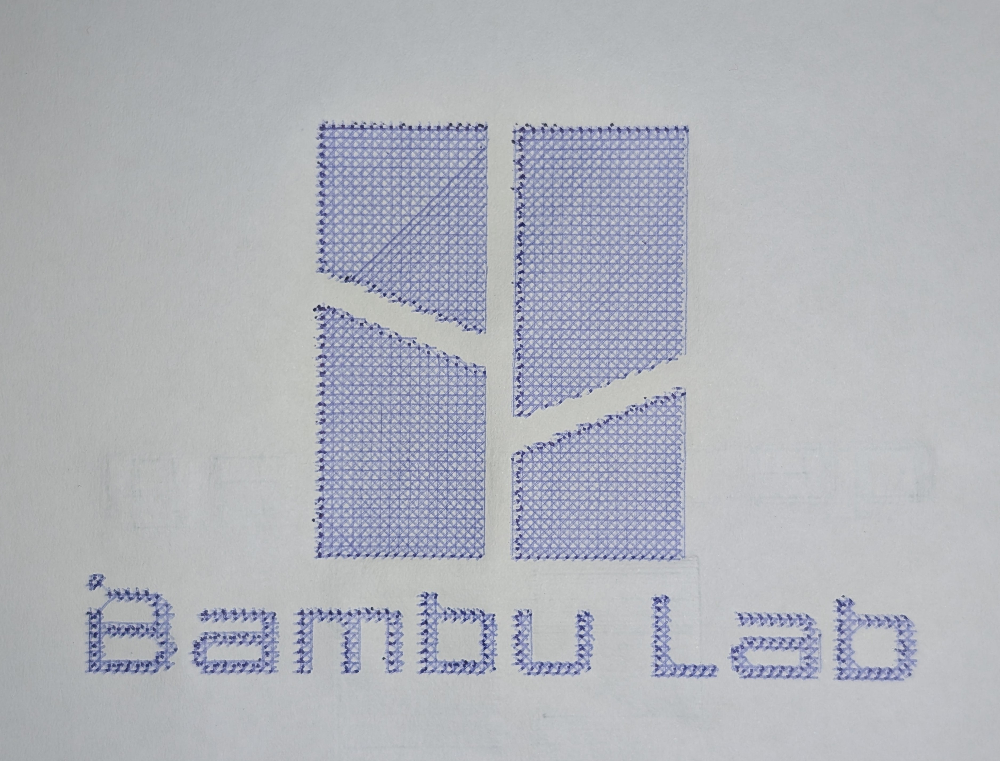
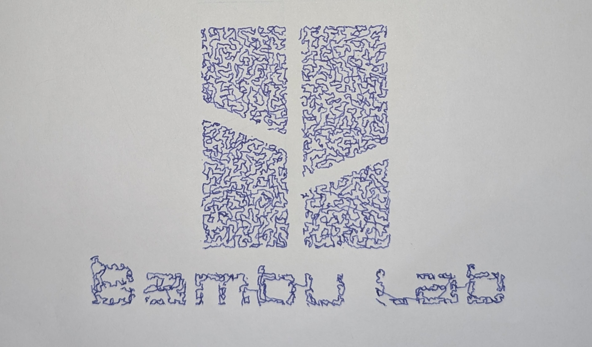
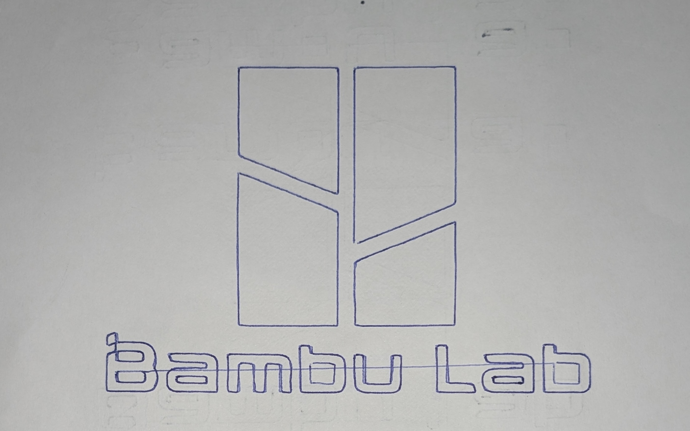
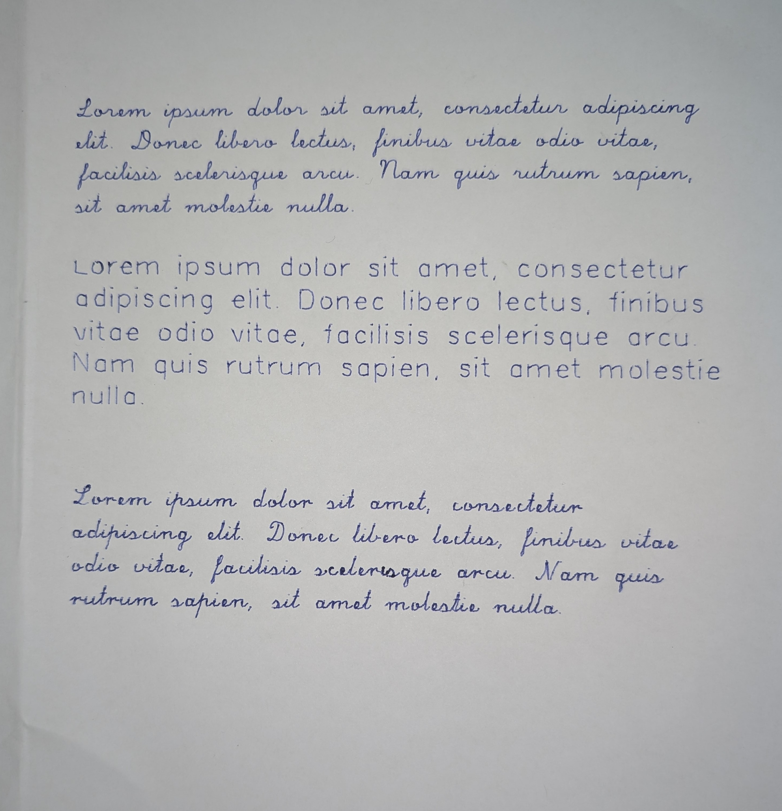
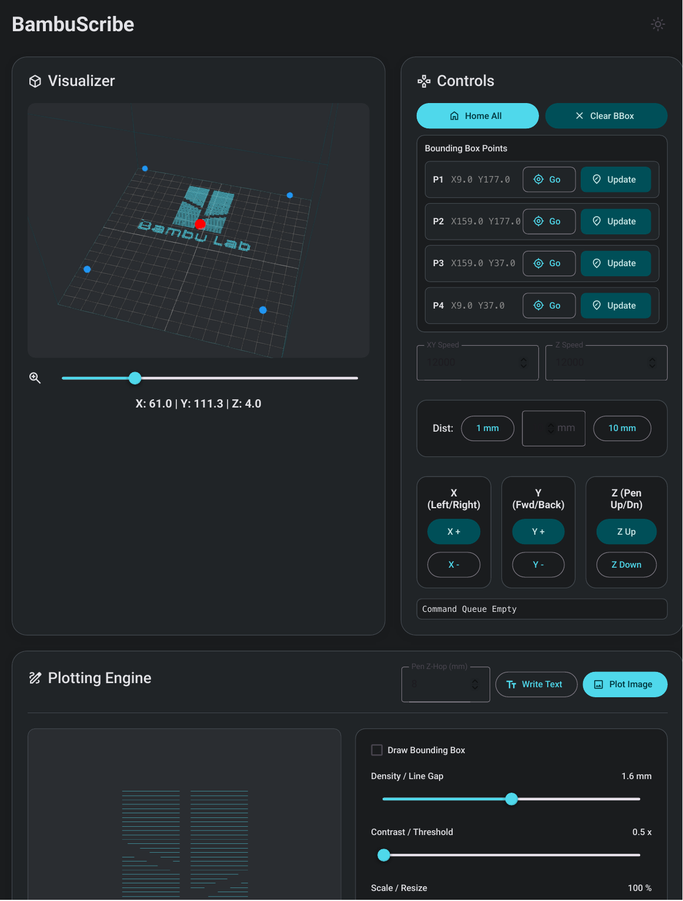
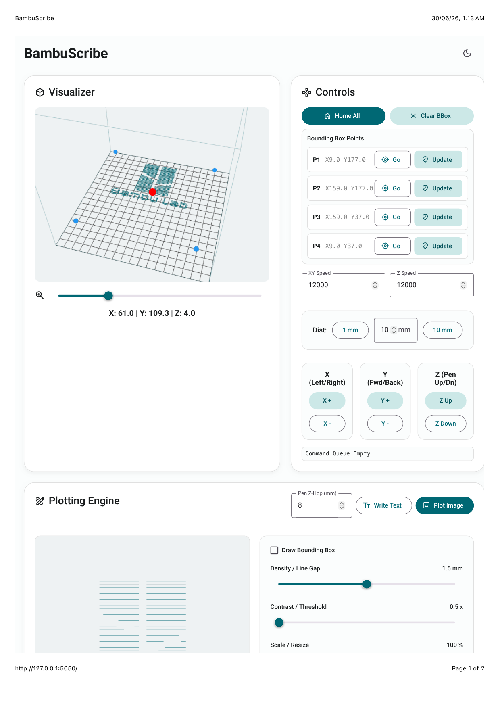
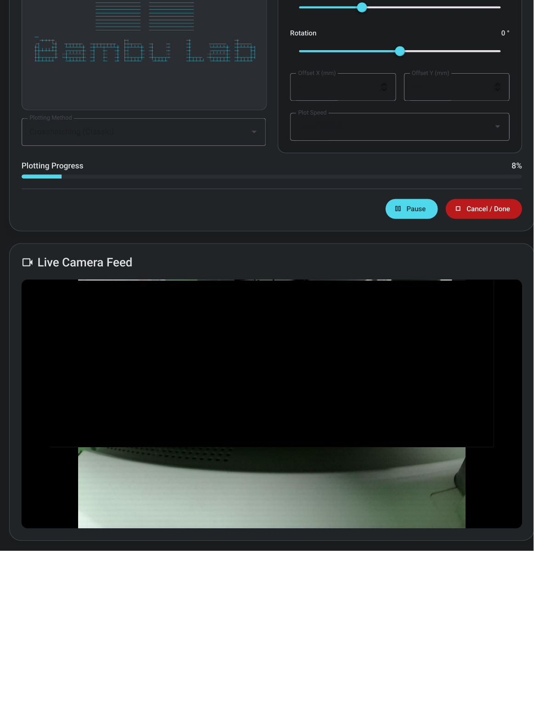
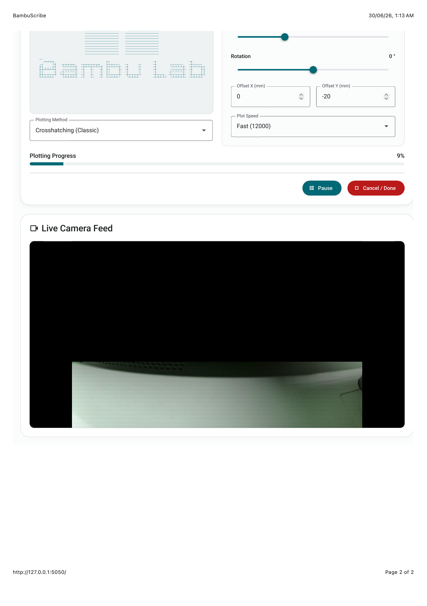

# BAMBUSCRIBE
**An open-source suite to transform your Bambu Lab 3D printer into a precision 2D plotter**


[](https://youtu.be/aic8SkLXlUo)

Bambu Lab printers possess incredibly fast, precise CoreXY kinematics. While they are phenomenal at extruding plastic, that same hardware is perfect for high-speed 2D plotting, drawing, and vector art. 

Usually, turning a 3D printer into a plotter requires fighting with slicer software, faking Z-heights, and manually transferring SD cards. BambuScribe bypasses all of that. By establishing a direct Service Level Connection (SLC) via MQTT and FTPS, BambuScribe packages and executes code autonomously over your local network, effectively turning your 3D printer into a live, interactive robotic arm controlled from your web browser.

---

## Hardware Setup & Recommendations

To use BambuScribe, you will need a physical pen attachment for your toolhead. 

After my search, the best one to my knowledge is the **A1 Plotter Module** designed by *TeQiller*. I am currently using this mount, and you can download it from [MakerWorld](https://makerworld.com/en/models/2433877-a1-plotter-module).

One thing I noticed with existing mounts is that the pen is physically offset from the nozzle. Because of this, I will be designing a custom pen holder in the near future. **If anyone has experience in CAD software, please help me with this!** 

**Crucial Hardware Recommendations:**
1. **Flip the Build Plate:** Turn your build plate over to the smooth/blank side before plotting. This provides a better drawing surface and protects your textured PEI coating from accidental ink stains or scratches.
2. **Set Pen Lower Than Nozzle:** Ensure the tip of your pen (should be a ball point!!) extends further down than the printer's hotend nozzle. Because BambuScribe uses dynamic Z-axis bounding boxes, this ensures the pen tip is the only thing making contact with your paper, preventing the nozzle from accidentally striking the bed.
3. **Use Bed Magnets:** It is highly recommended to secure your paper using strong magnets placed along the edges of your build plate to prevent the paper from sliding or shifting during rapid movement.

<div align="center">
  
  <br>
  <i>A4 size paper attached with two edge magnets on the A1 mini printing with the pen</i>
</div>

---

<h3 align="center">Contents</h2>

<p align="center">
  <a href="#features">Features</a> •
  <a href="#showcase">Showcase</a> •
  <a href="#how-it-works">How It Works</a> •
  <a href="#interface-overview">Interface Overview</a> •
  <a href="#known-issues--limitations">Known Issues</a>
  <br>
  <a href="#roadmap">Roadmap</a> •
  <a href="#technical-stack">Tech Stack</a> •
  <a href="#build-instructions">Build</a> •
  <a href="#contact">Contact</a>
</p>

---

## Features

- **Untethered Autonomous Plotting (New in v1.1.0!):** Choose to package your plot into a Bambu-compliant `.3mf` file. BambuScribe will securely upload it directly to your printer's SD card via Implicit FTPS and trigger the print. You can safely close your laptop or turn off your PC while the printer works!
- **Live MQTT Streaming:** Prefer a live approach? BambuScribe can still calculate the toolpath in the browser, send it to the Flask backend, and stream raw G-code chunks directly to the printer over LAN in real-time.
- **Printer Support:** Officially tested and supported on the Bambu Lab A1 Mini, featuring Beta support for the standard Bambu Lab A1.
- **Interactive 3D Visualizer:** Features a built-in Three.js digital twin of your printer's build volume. Watch your toolhead move in real-time and preview exactly where ink will touch the paper before you hit print.
- **Native Text Engine:** Uses Hershey Vector Fonts to generate pure single-line text paths. Features auto-wrapping, scaling, and cursive/standard typography styles. 
- **Advanced Image Processing:** Upload an image and let the internal OpenCV/Pillow engine convert it into plotter-safe G-code with beautifully implemented styling algorithms.
- **Live Camera Feed:** Injects the Bambu Lab raw JPEG stream directly into the UI so you can monitor your plot remotely.
- **Virtual Bounding Boxes:** Jog the printhead to your paper's 4 corners and set a virtual bounding box to define your physical canvas. BambuScribe uses the Z-height of your first recorded point as the global reference for the drawing plane, safely accommodating various paper, pen or material thicknesses.

---

## Showcase

BambuScribe's processing engine is fully featured and capable of handling complex image algorithms and typography with precision. All image generation constraints have been resolved and implemented beautifully.

### Video Demo

See BambuScribe (v1.1.0) in action! Watch the demonstration video on YouTube:

<div align="center">
  <a href="https://youtu.be/aic8SkLXlUo">
    
  </a>
  <br>
  <i>Click the thumbnail above to watch the demo video!</i>
</div>
<br>

### Image Styles

<div align="center">

| Original Reference |            Crosshatching <br>*(Supports down to 0.1mm, shot at ~0.6mm)*             | Stippling (TSP) | Edge / Line Art |
|:---:|:-----------------------------------------------------------------------------------:|:---:|:---:|
|  |  |  |  |
</div>

### Typography & Text Engine

<div align="center">
  
  <br><br>
  <i>Showcasing the following text written in <b>Cursive</b>, <b>Standard</b>, and <b>Fancy Cursive</b> font styles respectively:</i>
  <br><br>
  <p>"Lorem ipsum dolor sit amet, consectetur adipiscing elit. Donec libero lectus, finibus vitae odio vitae, facilisis scelerisque arcu. Nam quis rutrum sapien, sit amet molestie nulla."</p>
</div>

---

## How It Works

### **The SD Handoff Pipeline**
When running autonomously, BambuScribe packages the raw plotted G-code into a standard `.3mf` ZIP archive containing metadata files (`[Content_Types].xml` and `slice_info.config`) to prevent the printer's touchscreen parser from crashing. It then connects to the printer via a secure FTP client on port 990, uploads the archive, and sends an MQTT `project_file` command to trigger the plot.

### **The Streaming Pipeline**
If running in live-stream mode, BambuScribe utilizes a **Custom Chunking Pipeline**. Because a printer's internal buffer will choke if you send a 50,000-line G-code file all at once over MQTT, the backend groups the paths into timed chunks, tracking acknowledgments from the printer to feed the buffer smoothly.

---

## Interface Overview

BambuScribe features a responsive, Material Design interface. Below are reference documents showcasing the Light and Dark mode variations of the control dashboard.

Because GitHub cannot natively render PDF files directly on the page, the user interface layouts are displayed below as images. 

You can access the original high-resolution vector PDF files directly here:
- [View Light Mode PDF (BambuScribe.pdf)](./assets/BambuScribe.pdf)
- [View Dark Mode PDF (BambuScribe_Bl.pdf)](./assets/BambuScribe_Bl.pdf)

### Interface Layouts (To be updated)

<div align="center">

| Dark Mode Panel | Light Mode Panel |
|:---:|:---:|
|  |  |
|  |  |

</div>

*Note: The actual camera feed view has been redacted in these documentation files for privacy.*

---

## Known Issues & Limitations

Please read these carefully before using the software:

- **SD Startup Delay:** After sending an untethered plot to the SD card, **the printer can take a good 5 to 15 seconds to unpack the 3MF file and begin moving.** The UI will say "Printing SD", but the machine may sit idle while it thinks. Be patient!
- **Streaming Mode Limitations:** If you choose to use the "Stream via Wi-Fi" option instead of the SD card method, your host computer *must* remain awake and connected to Wi-Fi for the entire duration of the plot. Additionally, streaming mode is significantly slower than SD mode due to real-time packet validation.
- **Unused Camera Feed:** Although the dashboard features a dedicated view for the live raw camera feed, it is currently unused—meaning it is not yet utilized for capturing timelapses or driving computer-vision-based auto-centering and calibration. This is set to change in the near future!
- **No Skew Calibration:** The engine does not currently skew or warp text/images to match an angled bounding box.
- **No Auto-Homing Recovery:** If the printer detects a hardware discrepancy (e.g., skipped steps), it will not auto-home to recover its coordinates. 
- **No Audio Cues:** There are currently no sound alerts for finished plots or system errors.
- **Network Requirements (LAN & Developer Mode):** You must have "LAN Only Mode" enabled on your printer (which temporarily disconnects it from the Bambu Handy cloud app), as well as "Developer Mode" turned on if it is applicable to your specific firmware version.

---

## Roadmap

*(Please note: There is no rigidly decided path forward. These features are just divided into phases for convenience and structure.)*

### **Core Formats & Hardware**
- **SVG & Document Support:** Bypass the internal engines entirely to upload pre-made vector art (.svg) and multi-page text documents (.pdf, .docx).
- **Custom Pen Hardware:** Designing and publishing a original, optimized 3D-printed screw mount to center the pen and fix the nozzle offset.
- **Multi-Color Support:** Adding pause sequences and UI prompts to allow for manual pen swapping for multi-colored plots.

### **Intelligence & Expansion**
- **Audio Cues & Sound Support:** Implementing auditory alerts and system pings for finished plots, manual pen swaps, or hardware boundary errors.
- **Expanded Image Algorithms:** Adding advanced dithering algorithms, halftone dots, and multi-pass CMYK color separation for images to offer even more creative choices.
- **Skew & Surface Interpolation:** Upgrading the bounding box math to support full affine transformations (skewing/warping text to match an angled bounding box) and 3D Z-height interpolation across all 4 corners to adapt to unlevel drawing planes.
- **AI Handwriting Replication:** Integrating a generative AI model that analyzes a sample of your physical handwriting and plots text vectors mimicking your exact penmanship.
- **Platform-Specific Apps:** Transitioning the web-wrapper into native Desktop/Mobile applications with session continuity.
- **Printer Expansion:** Abstracting the kinematics engine to officially support the Bambu Lab P1P, P1S, X1C, and eventually non-Bambu network-capable CoreXY printers.

---

## Technical Stack

- **Backend:** Python 3.10+, Flask
- **Communication:** Paho-MQTT, Implicit FTPS, Socket/SSL (for Camera Stream)
- **Frontend UI:** HTML/CSS/JS, Material Web Components
- **3D Engine:** Three.js
- **Media Processing:** OpenCV (Canny Edge), NumPy, Pillow (Image processing), Hershey-Fonts (Vector typography)

---

## Build Instructions

BambuScribe comes with a highly automated setup script that handles virtual environments and dependency management for you. 

Ensure you have Python 3.10+ installed on your system.

**Finding Your Printer Credentials:**
Before running the setup, you will need some information from your printer's physical screen:
- **Developer Mode, IP, and Access Code:** Navigate to `Settings (3/4) > LAN only mode`. After turning on LAN Only Mode, the Developer Mode option will become visible. Turn that on as well. You will find your IP and Access Code on this page.
- **Serial Number:** Navigate to `Settings (1/4) > Device`. It is labeled as the `printer SN`.

```bash
# 1. Clone the repository
git clone https://github.com/Animesh-Varma/BambuScribe.git
cd BambuScribe

# 2. Run the automated setup script
# This will ask for your Printer IP, Access Code, and Serial Number.
# It will then create a secure config, build the virtual environment, 
# and install all dependencies automatically.
python setup.py

# 3. Launch the application (if you didn't auto-launch from the setup script)
# On Mac/Linux:
source venv/bin/activate
python app.py

# On Windows:
venv\Scripts\activate
python app.py
```
Once running, open your web browser and navigate to `http://localhost:5050`.

---

## Contact

**Note:** I am a high school student building this in my spare time. My foray into hardware orchestration, G-code manipulation, and network protocols is an ongoing learning process. Contributors, pull requests, and general advice are always welcome.

Email: `animesh_varma@protonmail.com`

---

## Disclaimer
Please take care and monitor your machine while using BambuScribe! Although the software requires homing before any movement and has strict guardrails in place, nothing is completely foolproof. Negligence could potentially lead to physical damage to your 3D printer or build plate. Always double-check everything manually, ensure your pen mount is properly secured, and have fun plotting!