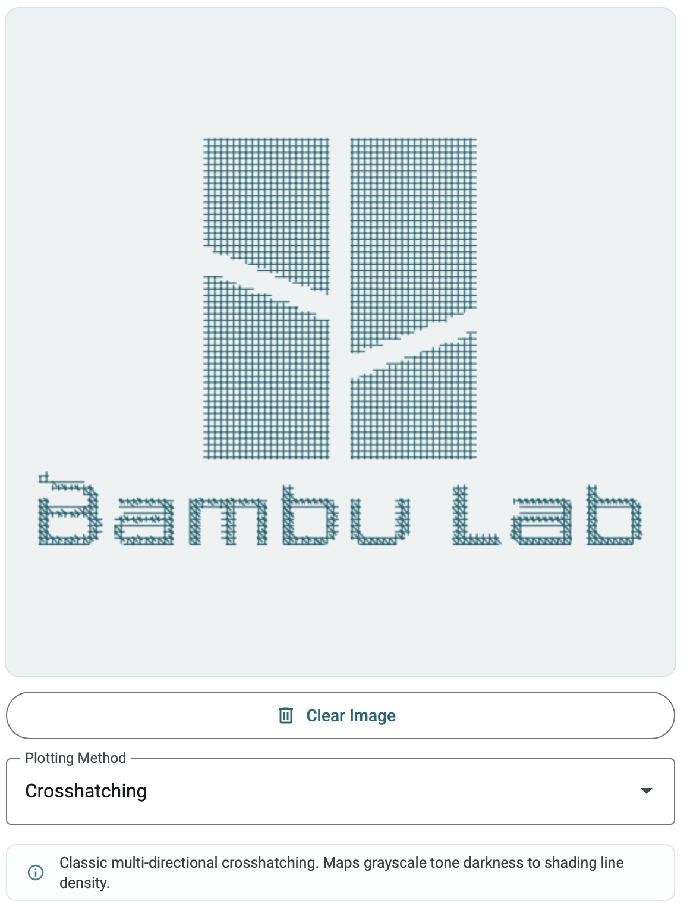
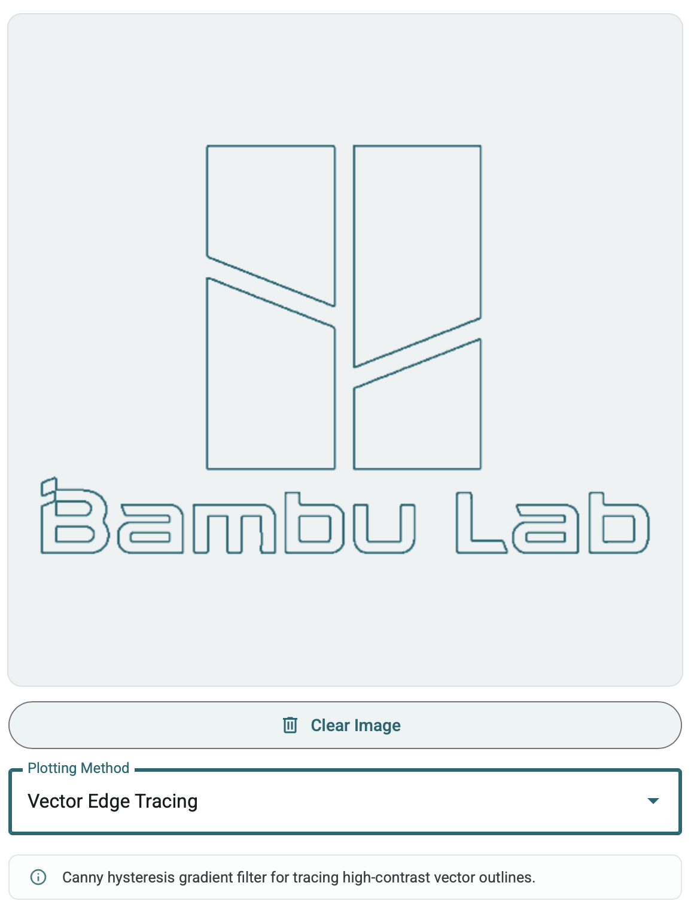
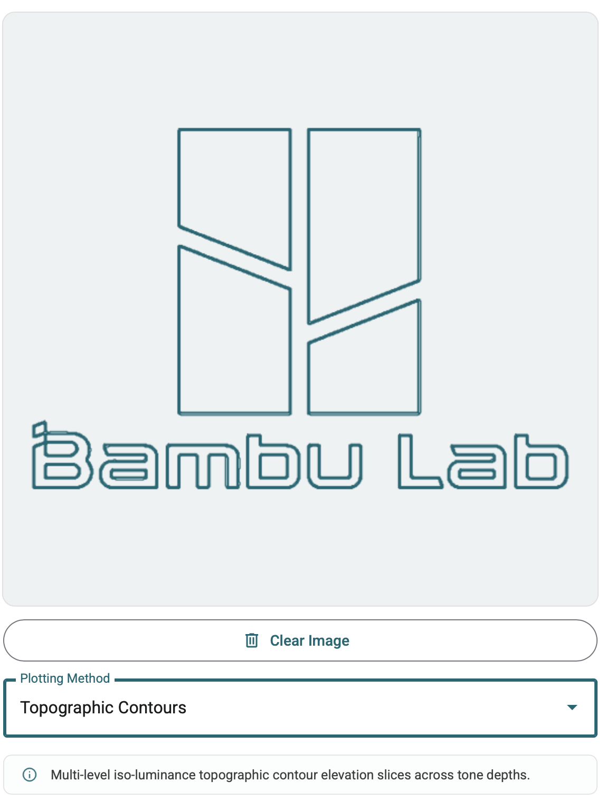
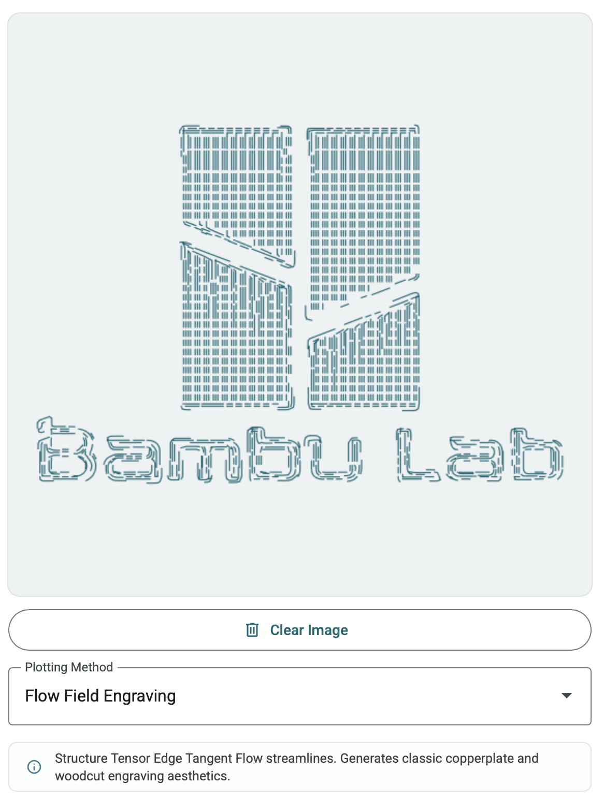
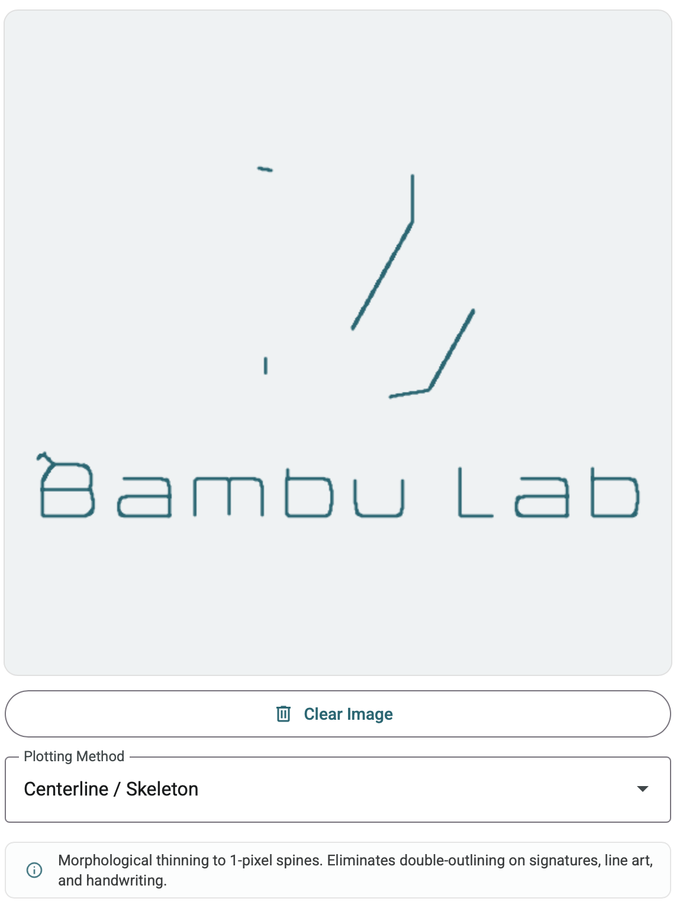
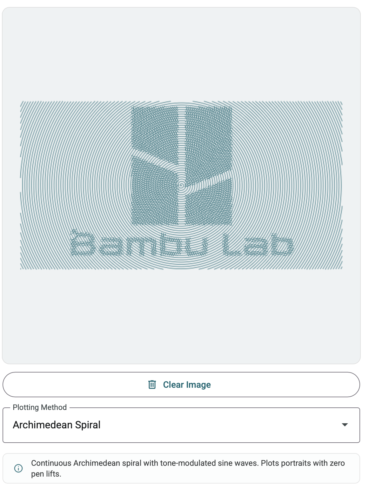
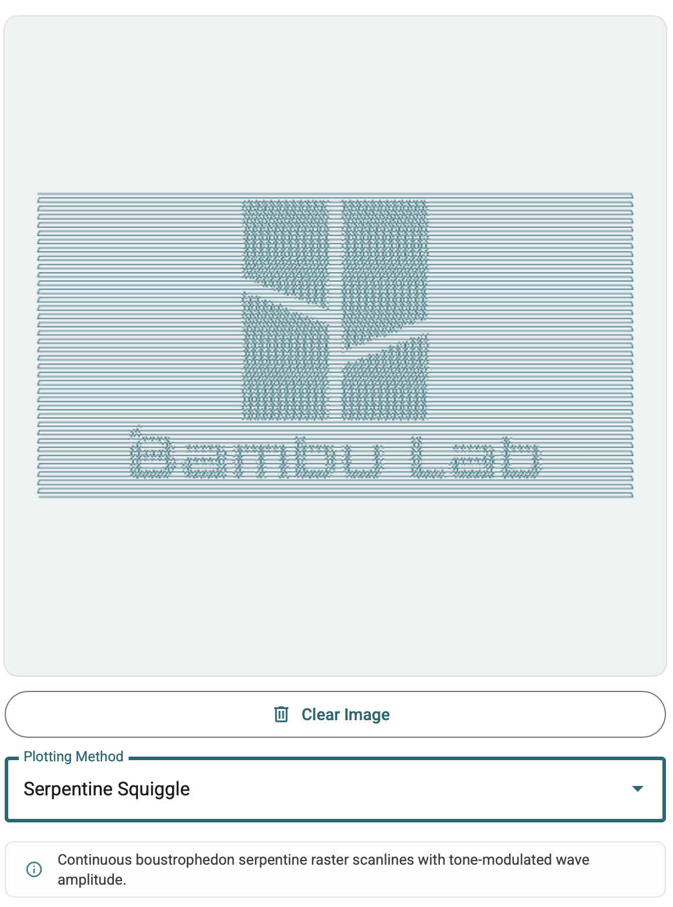
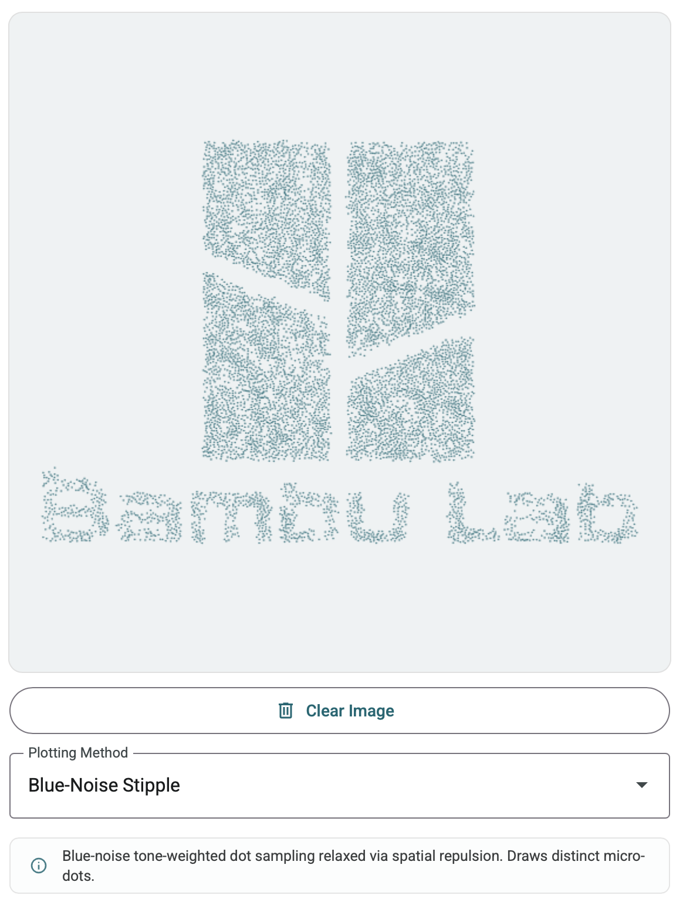
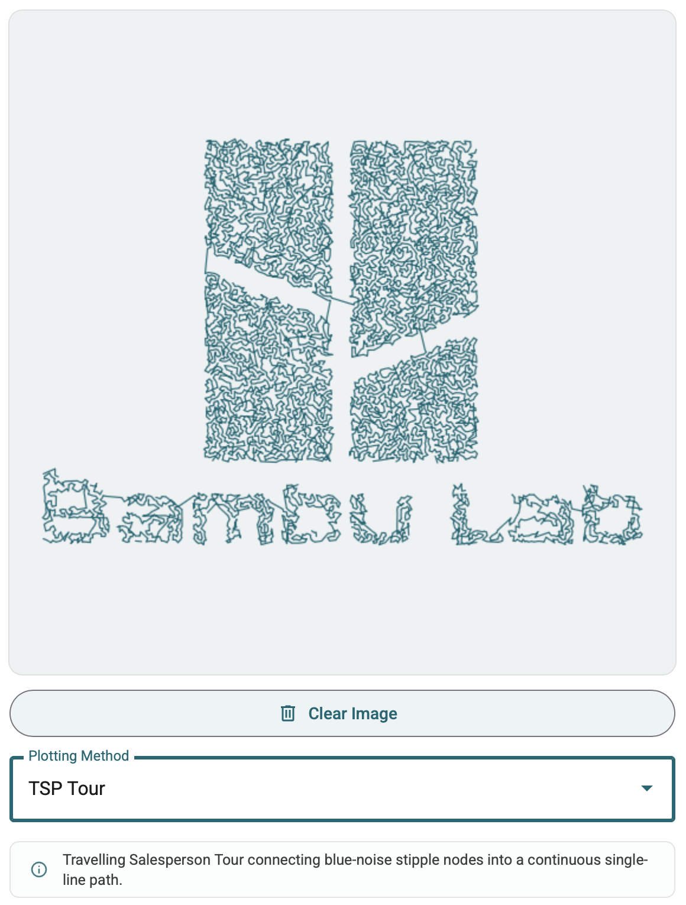
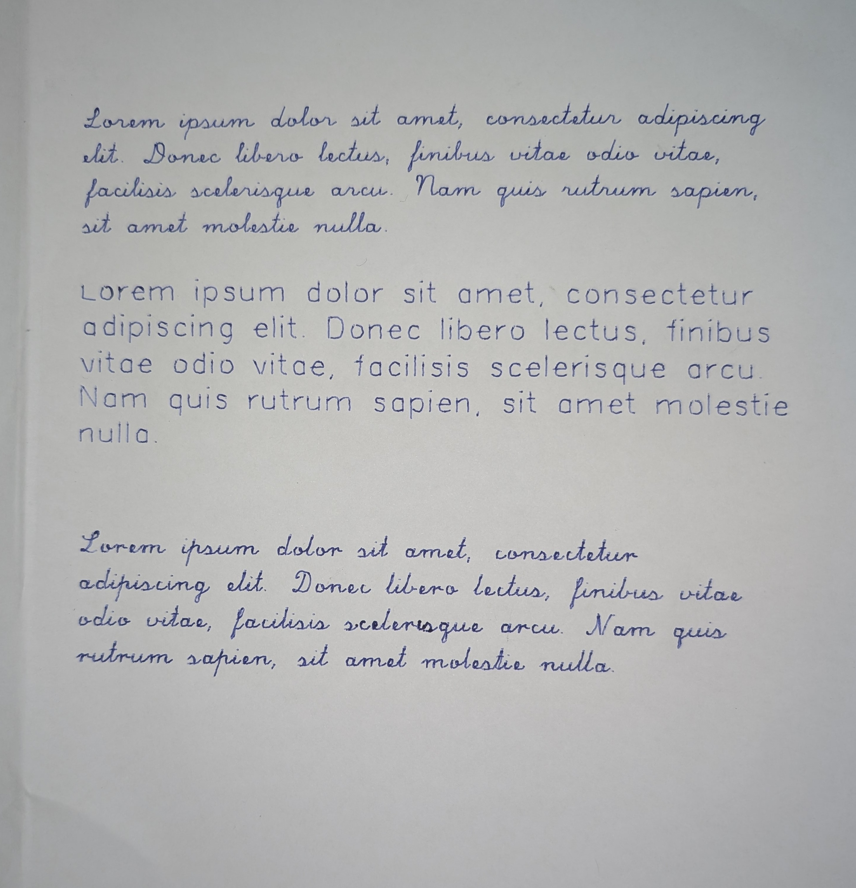

# BAMBUSCRIBE
**An open-source suite to transform your Bambu Lab 3D printer into a precision 2D plotter**


[](https://animesh-varma.github.io/BambuScribe/)
[](https://github.com/users/Animesh-Varma/projects/3)
[-red?style=flat-square&logo=youtube)](https://www.youtube.com/watch?v=aic8SkLXlUo)

Bambu Lab printers possess incredibly fast, precise CoreXY kinematics. While they are phenomenal at extruding plastic, that same hardware is perfect for high-speed 2D plotting, drawing, and vector art. 

Usually, turning a 3D printer into a plotter requires fighting with slicer software, faking Z-heights, and manually transferring SD cards. BambuScribe simplifies this entire workflow. Supporting both direct local machine orchestration (via MQTT/FTPS) and **serverless web execution via Pyodide WebAssembly**, BambuScribe packages and executes vector art autonomously, effectively turning your 3D printer into a live plotter right from your browser.

>  **Want to try it without installing anything?** Launch the standalone [**BambuScribe Web App**](https://animesh-varma.github.io/BambuScribe/) directly in your browser to configure your canvas, generate vector art, preview toolpaths, and download ready-to-run G-code!

---

## Hardware Setup & Recommendations

To use BambuScribe, you will need a physical pen attachment for your toolhead. 

After my search, the best one to my knowledge is the **A1 Plotter Module** designed by *TeQiller*. I am currently using this mount, and you can download it from [MakerWorld](https://makerworld.com/en/models/2433877-a1-plotter-module).

One thing I noticed with existing mounts is that the pen is physically offset from the nozzle. Because of this, I will be designing a custom pen holder by the next release. **If anyone has experience in CAD software, please help me with this!** 

**Crucial Hardware Recommendations:**
1. **Flip the Build Plate:** Turn your build plate over to the smooth/blank side before plotting. This provides a better drawing surface and protects your textured PEI coating from accidental ink stains or scratches.
2. **Set Pen Lower Than Nozzle:** Ensure the tip of your pen (should be a ball point!!) extends further down than the printer's hotend nozzle. Because BambuScribe uses dynamic Z-axis bounding boxes, this ensures the pen tip is the only thing making contact with your paper, preventing the nozzle from accidentally striking the bed.
3. **Use Bed Magnets:** It is highly recommended to secure your paper using strong magnets placed along the edges of your build plate to prevent the paper from sliding or shifting during rapid movement.

<div align="center">
  
  <br>
  <i>A4 size paper attached with two edge magnets on the A1 mini printing with the pen</i>
</div>

---

<h3 align="center">Contents</h3>

<p align="center">
  <a href="#features">Features</a> •
  <a href="#showcase">Showcase</a> •
  <a href="#how-it-works">How It Works</a> •
  <a href="#try-the-interface">Web App</a> •
  <a href="#known-issues--limitations">Known Issues</a>
  <br>
  <a href="#roadmap--project-board">Roadmap</a> •
  <a href="#technical-stack">Tech Stack</a> •
  <a href="#build--usage-instructions">Build & Usage</a> •
  <a href="#contact">Contact</a>
</p>

---

## Features

- **Dual-Mode Architecture (Local & Serverless Web):**
  - **Local Mode:** Connects to a modular local Flask backend for full physical hardware orchestration, live MQTT streaming, SD card uploads via FTPS, and live camera feed monitoring.
  - **Web Mode (Pyodide Wasm):** Run the complete vector generation, path optimization, and G-code engine inside any modern browser using client-side WebAssembly—no Python environment or local server required! Includes static canvas calibration and graceful offline hardware locks.
- **Advanced Vector Generation Algorithms:**
  - Full suite of plotting algorithms: **Skeleton, Spiral, Squiggle, Flow-Field, Stipple (TSP), Contour, Crosshatching, and Edge / Line Art**.
  - Arbitrary polyline generation with pen-width simulation and context-sensitive Material Design controls.
- **6-Stage Path Optimization Pipeline:**
  - Drastically optimizes drawing sequences and cuts plot times using sub-line-width Ramer–Douglas–Peucker (RDP) path decimation, segment sorting, and travel distance minimization.
- **Dynamic Bounding Box Clipping & Out-of-Bounds Preview:**
  - Mathematically slices vector segments at the bounding box boundaries via `split_segment_by_bbox` without throwing hard errors.
  - Slices paths into `safe_paths` (printable) and `out_paths` (clipped), dynamically rendering out-of-bounds segments in high-contrast red on both the 2D canvas and 3D visualizer.
- **Standalone G-code Export & SD Execution:**
  - Generate standalone, safe G-code with configurable plot parameters via `/api/download_gcode` or directly from the Web App.
  - Built-in 4-step standalone SD execution flow: *Pre-home warning pause → G28 auto-home → Energized pause → Plot execution*.
  - Step-by-step interactive instructions modal for standalone SD card plotting.
- **Strict Homing Enforcement & Guardrails:**
  - Direct plotting commands strictly require the machine to be homed first (`G28`). Dedicated UI popup modals alert and block unhomed operations to protect your toolhead.
- **Interactive 3D Visualizer:**
  - Digital twin build volume rendered via Three.js. Automatically updates previews in real-time, displays ink contact lines, highlights out-of-bounds paths in red, and previews physical toolhead paths.
- **Native Typography Engine:**
  - Single-line Hershey vector typography featuring live word-wrapping, scaling, and cursive, standard, or fancy script styles.
- **Untethered `.3mf` Packaging (Local Mode):**
  - Packages raw toolpaths into Bambu-compliant `.3mf` archives and transfers them over Implicit FTPS (port 990) for completely autonomous plotting.
- **Live MQTT Streaming (Local Mode):**
  - Custom real-time packet chunking engine streams raw G-code over local Wi-Fi with acknowledgment tracking.

---

## Showcase

### Video Walkthrough

<div align="center">
  <a href="https://www.youtube.com/watch?v=aic8SkLXlUo">
    
  </a>
  <br>
  <i>⚠️ <b>Note:</b> This demo showcases v1.1.0 and does not reflect the new serverless mode, or expanded algorithm suite. An updated walkthrough is currently in production!</i>
</div>

<br>

### Image Styles & Visualizer Previews

Below are visualizer-generated vector paths produced by BambuScribe's mathematical engines. *(Due to the time required to physically plot every high-density variation on paper, these showcases represent the exact toolpaths rendered by the 2D/3D visualizer preview engine).*

<div align="center">

| Original Reference | Crosshatching | Vector Edge Tracing | Topographic Contours | Flow Field Engraving |
|:---:|:---:|:---:|:---:|:---:|
|  |  |  |  |  |

| Centerline / Skeleton | Archimedean Spiral | Serpentine Squiggle | Blue-Noise Stipple | TSP Tour |
|:---:|:---:|:---:|:---:|:---:|
|  |  |  |  |  |

</div>

<details>
<summary><b> Algorithmic Details & Functions</b></summary>
<br>

- **Crosshatching (`gen_hatch`):** Directional multi-pass crosshatching across 4 angle intervals with progressive thresholding.
- **Vector Edge Tracing (`gen_canny`):** Canny edge detection followed by contour polyline extraction.
- **Topographic Contours (`gen_contours`):** Multi-level Gaussian-blurred threshold contour extraction across brightness levels.
- **Flow Field Engraving (`gen_flow_field`):** Sobel gradient tensor vector fields with tone-spaced seed points and bidirectional streamline tracing.
- **Centerline / Skeleton (`gen_skeleton`):** Otsu binarization with vectorized Zhang-Suen morphological thinning and graph polyline tracing.
- **Archimedean Spiral (`gen_spiral`):** Center-outward spiral with tone-modulated sinusoidal wave amplitudes.
- **Serpentine Squiggle (`gen_squiggle`):** Alternating horizontal scanlines with tone-modulated sinusoidal wave amplitudes.
- **Blue-Noise Stipple (`gen_stipple`):** Probabilistic tone rejection sampling with 2-pass spatial repulsion relaxation for standalone dot marks.
- **TSP Tour (`gen_stipple` with `tsp_connect=True`):** Traveling Salesperson nearest-neighbor path linking relaxed stipple points into continuous single-line strokes.

</details>

### Typography & Text Engine

<div align="center">
  
  <br><br>
  <i>Showcasing the following text written in <b>Cursive</b>, <b>Standard</b>, and <b>Fancy Cursive</b> font styles respectively:</i>
  <br><br>
  <p>"Lorem ipsum dolor sit amet, consectetur adipiscing elit. Donec libero lectus, finibus vitae odio vitae, facilisis scelerisque arcu. Nam quis rutrum sapien, sit amet molestie nulla."</p>
</div>

---

## How It Works

### **1. Dual Execution Engines**
- **Web Mode (Pyodide / WASM):** Automatically detected when hosted statically on GitHub Pages. Vector algorithms, path optimization, and G-code generation run entirely inside an in-browser WebWorker powered by Pyodide, allowing you to configure, preview, and download ready-to-run G-code without running a local Python server.
- **Local Mode (Flask Backend):** Connects to a modular Python service running locally. Enables full device control, direct coordinate jogging, live camera feeds, and automated network uploads.

### **2. Path Optimization & Clipping Pipeline**
Before ink ever touches paper, input curves and vectors are processed through a 6-stage pipeline:
1. **Mathematical Clipping:** Vectors intersecting the canvas boundaries are sliced via `split_segment_by_bbox`.
2. **Sub-line-width RDP Decimation:** Micro-segments and collinear points are reduced using the Ramer–Douglas–Peucker algorithm to prevent jerky toolhead motion.
3. **TSP / Path Reordering:** Travel moves are minimized to speed up overall execution.
4. **Out-of-Bounds Classification:** Out-of-bounds segments are separated into `out_paths` and displayed in red on the 3D visualizer.

### **3. Autonomous SD Execution & Streaming**
- **Autonomous SD / 3MF:** BambuScribe packages plotted toolpaths into a valid `.3mf` ZIP archive containing metadata files to satisfy the printer's internal parser. It uploads the package over Implicit FTPS (port 990) and commands the printer via MQTT to initiate printing.
- **Direct G-Code Export:** Standalone G-code files include safe sequencing: pre-homing warning pauses, `G28` auto-homing, energized pen-drop verification pauses, and coordinated drawing routines.
- **Live MQTT Chunking:** For live-streaming, BambuScribe batches paths into rate-limited chunks, tracking firmware acknowledgments to ensure the printer's command buffer is fed reliably.

---

## Try the Interface

Rather than browsing static screenshots, you can explore and test the entire interface live!

<div align="center">
  <br>
  <a href="https://animesh-varma.github.io/BambuScribe/">
    
  </a>
  <br><br>
  <p><i>The static web deployment runs the entire vector engine via WebAssembly directly in your browser. You can input text, load images, test all vector algorithms, inspect 3D toolpaths, and export standalone G-code immediately.</i></p>
</div>

---

## Known Issues & Limitations

- **SD Unpack Latency:** After uploading an untethered `.3mf` plot to the SD card, the printer may take 5–15 seconds to unpack and inspect the archive before moving.
- **Streaming Mode Constraints:** Streaming over MQTT requires your host machine to remain awake and on the same Wi-Fi network throughout the duration of the plot.
- **No Skew Calibration:** The engine does not currently apply affine skew transformations to counter angled paper boundaries.
- **LAN & Developer Mode Required (Local Mode):** When using local hardware orchestration, the printer must be switched to **LAN Only Mode** with **Developer Mode** enabled.

---

## Roadmap & Project Board

Active development, upcoming tasks, feature requests, and bug tracking are tracked live on the official GitHub Project Board:

**[View the BambuScribe Project Board & Roadmap](https://github.com/users/Animesh-Varma/projects/3)**

### Current Priorities
- **Core Formats & Hardware:** Direct `.svg` / vector document uploads, custom centered pen mount design, and multi-color pen pause sequences.
- **Vision & Calibration:** Leveraging the live camera feed with computer vision for automatic paper boundary alignment.
- **Surface Math:** 4-corner affine transformations and 3D Z-height bilinear interpolation across unlevel drawing planes.
- **Expanded Hardware Support:** Expanding testing and kinematics profiles to the Bambu Lab P1P, P1S, X1C, and third-party CoreXY machines.

---

## Technical Stack

- **Architecture:** Dual-mode architecture (Local Flask server or Static Serverless Pyodide WebAssembly).
- **Backend (Local Mode):** Python 3.10+, Flask, modular architecture (`config`, `state`, `camera`, `algorithms`, `printer`).
- **Network Protocols:** Paho-MQTT, Implicit FTPS (TLS 1.2+), Raw Socket/SSL (Camera stream).
- **Frontend:** ES6 Modules (`main.js`, `visualizer.js`), Material Web Components (M3), Three.js (Digital Twin visualizer).
- **Vector & Image Processing:** OpenCV, Pillow, Hershey-Fonts, NumPy, Ramer–Douglas–Peucker (RDP) path decimation.

---

## Build & Usage Instructions

### Option 1: Web Mode (Zero Install)
Open [**https://animesh-varma.github.io/BambuScribe/**](https://animesh-varma.github.io/BambuScribe/) in any modern desktop browser (Chrome, Edge, Firefox). Pyodide will initialize automatically in a background WebWorker, giving you instant access to vector generation, live 3D visualizers, and G-code export.

### Option 2: Local Mode (Direct Printer Orchestration)

**Finding Your Printer Credentials:**
Before running the setup, you will need some information from your printer's physical screen:
- **Developer Mode, IP, and Access Code:** Navigate to `Settings (3/4) > LAN only mode`. After turning on LAN Only Mode, the Developer Mode option will become visible. Turn that on as well. You will find your IP and Access Code on this page.
- **Serial Number:** Navigate to `Settings (1/4) > Device`. It is labeled as the `printer SN`.

```bash
# 1. Clone the repository
git clone https://github.com/Animesh-Varma/BambuScribe.git
cd BambuScribe

# 2. Run the automated setup script
# This will ask for your Printer IP, Access Code, and Serial Number.
# It will then create a secure config, build the virtual environment, 
# and install all dependencies automatically.
python setup.py

# 3. Launch the application (if you didn't auto-launch from the setup script)
# On Mac/Linux:
source venv/bin/activate
python app.py

# On Windows:
venv\Scripts\activate
python app.py
```
Once running, open your web browser and navigate to `http://localhost:5050`.

---

## Contact

**Note:** I am a high school student building this in my spare time. My foray into hardware orchestration, G-code manipulation, and network protocols is an ongoing learning process. Contributors, pull requests, and feedback are always welcome!

Email: `animesh_varma@protonmail.com`

---

## Disclaimer

Please take care and monitor your machine while using BambuScribe! Although the software requires homing before any movement and has strict guardrails in place, nothing is completely foolproof. Negligence could potentially lead to physical damage to your 3D printer or build plate. Always double-check everything manually, ensure your pen mount is properly secured, and have fun plotting!